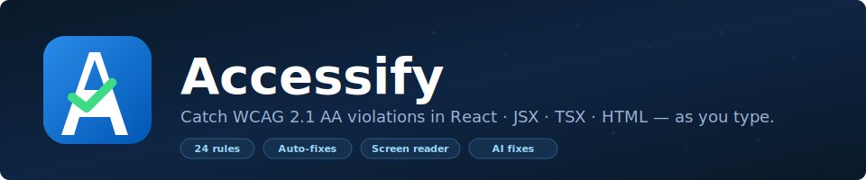

<p align="center">
  
</p>

<p align="center">
  <a href="https://marketplace.visualstudio.com/items?itemName=garvit-magoo.accessify"></a>
  <a href="https://marketplace.visualstudio.com/items?itemName=garvit-magoo.accessify"></a>
  <a href="https://marketplace.visualstudio.com/items?itemName=garvit-magoo.accessify"></a>
  <a href="LICENSE"></a>
  <a href="https://www.w3.org/WAI/WCAG21/quickref/"></a>
</p>

Accessify is a real-time accessibility linter for the editor. It scans React, JSX, TSX, and HTML against **24 WCAG 2.1 Level A & AA rules** as you type, offers one-click fixes (deterministic and AI-powered), and includes a screen reader preview so you can hear your UI the way assistive-technology users do.

---

## See it in action

**Catch issues the moment you type them.**

<p align="center">
  
</p>

**Fix them with one keystroke.** Press `⌘.` (or `Ctrl+.`) to open Quick Fix.

<p align="center">
  
</p>

**Hear what a screen reader will say.** Open `Accessify: Screen Reader Preview` for the active file.

<p align="center">
  
</p>

---

## Why Accessify

Most a11y tools catch issues at runtime, in the browser, after deployment. Accessify shifts that left into the editor:

- **Real time.** Diagnostics appear as you type, with a debounced scan.
- **Explain the why.** Every issue links to its WCAG criterion and the corresponding axe-core docs.
- **Fix with confidence.** Static and AI fixes both show a confidence score and risk level before you apply them.
- **Hear your UI.** The screen reader simulator announces elements out loud using the Web Speech API — voice, rate, and per-row playback.
- **Zero config.** Works out of the box. AI features are opt-in.
- **CI-ready.** Export SARIF for GitHub Code Scanning.

---

## Quick start

Install from the Marketplace:

```bash
code --install-extension garvit-magoo.accessify
```

Or search **Accessify** in the Extensions panel.

That's it. Open any `.tsx` / `.jsx` / `.html` file and Accessify will start scanning. Issues show up as squiggles. Hover for the message; press `⌘.` (`Ctrl+.` on Windows/Linux) to apply a fix.

### Keyboard shortcuts

| Shortcut             | Action                    |
| -------------------- | ------------------------- |
| `⌘⌥R` / `Ctrl+Alt+R` | Open Accessibility Report |
| `⌘⌥F` / `Ctrl+Alt+F` | Static Fix Current File   |

### Commands

All commands are prefixed with `Accessify:` in the Command Palette (`⌘⇧P`):

- `Show Accessibility Report`
- `Screen Reader Preview`
- `Static Fix Current File` · `Static Fix Workspace`
- `AI Fix Entire File` · `Bulk AI Fix Workspace`
- `Generate A11y Unit Tests`
- `Export Report` (SARIF or JSON)
- `Set AI API Key`
- `Open Settings`

---

## Rules (24)

Accessify ships with 24 rules covering WCAG 2.1 Level A and AA.

| Rule                                     | WCAG   | Severity | What it catches                                               |
| ---------------------------------------- | ------ | -------- | ------------------------------------------------------------- |
| `img-alt`                                | 1.1.1  | Error    | `` without an `alt` attribute                            |
| `nextjs-image-alt`                       | 1.1.1  | Error    | Next.js `<Image>` without `alt`                               |
| `nextjs-link-text`                       | 1.1.1  | Warning  | Next.js `<Link>` without discernible text                     |
| `svg-has-accessible-name`                | 1.1.1  | Warning  | `<svg>` missing `<title>`, `aria-label`, or `aria-labelledby` |
| `media-has-caption`                      | 1.2.2  | Error    | `<video>` / `<audio>` without captions (unless muted)         |
| `form-label`                             | 1.3.1  | Warning  | Form inputs without an associated label                       |
| `label-has-associated-control`           | 1.3.1  | Warning  | `<label>` not linked to a control via `htmlFor` or wrapping   |
| `heading-order`                          | 1.3.1  | Warning  | Heading levels skipped (e.g. `h1` → `h3`)                     |
| `prefer-semantic-elements`               | 1.3.1  | Warning  | `<div role="…">` where a native element exists                |
| `autocomplete-valid`                     | 1.3.5  | Warning  | Personal-data inputs without valid `autoComplete`             |
| `color-contrast`                         | 1.4.3  | Warning  | Inline / Tailwind foreground+background below 4.5:1           |
| `no-mouse-only-hover`                    | 1.4.13 | Warning  | Hover content with no keyboard equivalent                     |
| `click-events-have-key-events`           | 2.1.1  | Warning  | `onClick` on non-interactive element without keyboard handler |
| `interactive-supports-focus`             | 2.1.1  | Warning  | Interactive element that isn't focusable                      |
| `skip-link`                              | 2.4.1  | Hint     | Layout missing a "Skip to content" link                       |
| `page-title`                             | 2.4.2  | Warning  | `<Head>` without a `<title>`                                  |
| `no-autofocus`                           | 2.4.3  | Warning  | `autoFocus` that disorients screen reader users               |
| `anchor-is-valid`                        | 2.4.4  | Warning  | `<a href="#">` or `href="javascript:void(0)"`                 |
| `focus-visible`                          | 2.4.7  | Warning  | Removes focus indicator without an alternative                |
| `nextjs-head-lang`                       | 3.1.1  | Error    | Next.js `<Html>` without `lang`                               |
| `aria-role`                              | 4.1.2  | Error    | Invalid ARIA role value                                       |
| `aria-pattern`                           | 4.1.2  | Error    | ARIA widget patterns missing required structure               |
| `button-label`                           | 4.1.2  | Error    | `<button>` without an accessible name                         |
| `no-noninteractive-element-interactions` | 4.1.2  | Warning  | Event handlers on non-interactive elements                    |

You can disable any rule, override severity, or scope rules by glob in `.a11yrc.json`.

---

## AI fixes (optional)

Accessify supports OpenAI, Azure OpenAI, and Anthropic Claude for context-aware fixes. AI is **off** by default; to enable:

1. Run `Accessify: Set AI API Key` and paste your key (stored in VS Code secret storage).
2. Run `Accessify: Open Settings` and pick a provider.
3. Use `Accessify: AI Fix Entire File` for a single file or `Bulk AI Fix Workspace` for everything.

Each AI fix shows confidence, reasoning, and a diff preview before anything is written. Caching is in-memory with a 10-minute TTL to keep API usage low.

```json
// settings.json
{
  "a11y.aiProvider": "claude",
  "a11y.aiModel": "claude-sonnet-4-20250514"
}
```

For Azure OpenAI:

```json
{
  "a11y.aiProvider": "azure-openai",
  "a11y.aiEndpoint": "https://your-resource.openai.azure.com",
  "a11y.aiModel": "your-deployment-name"
}
```

---

## Project config (`.a11yrc.json`)

Drop a `.a11yrc.json` at your project root to customize rules and exclusions:

```json
{
  "rules": {
    "color-contrast": { "severity": "error" },
    "heading-order": false
  },
  "exclude": ["**/test/**", "**/storybook/**"],
  "aiExclude": ["**/legacy/**"]
}
```

Disabled rules and excluded files are respected by diagnostics, the report panel, SARIF/JSON exports, and bulk fixes.

---

## CI / CD

Generate a SARIF report and feed it into GitHub Code Scanning:

```bash
code --command a11y.exportReport
```

```yaml
# .github/workflows/a11y.yml
- uses: github/codeql-action/upload-sarif@v3
  with:
    sarif_file: a11y-report.sarif
```

---

## Settings reference

| Setting                   | Default   | Description                                         |
| ------------------------- | --------- | --------------------------------------------------- |
| `a11y.scanOnSave`         | `true`    | Scan on save                                        |
| `a11y.scanOnOpen`         | `true`    | Scan when a file is opened                          |
| `a11y.severity`           | `warning` | Default diagnostic severity                         |
| `a11y.aiProvider`         | `none`    | `openai` / `azure-openai` / `claude` / `none`       |
| `a11y.aiModel`            | `""`      | Model / deployment name (provider default if blank) |
| `a11y.aiEndpoint`         | `""`      | Required for Azure OpenAI                           |
| `a11y.aiBatchConcurrency` | `10`      | Parallel files during bulk AI fix (1–10)            |
| `a11y.scanConcurrency`    | `8`       | Parallel files during workspace scans (1–32)        |

---

## Development

```bash
git clone https://github.com/garvit-magoo/accessify.git
cd accessify
npm install
npm run compile
```

Press `F5` to launch the Extension Development Host.

```bash
npm test                  # unit tests
npm run test:integration  # integration tests in a real VS Code instance
npx @vscode/vsce package  # build a .vsix
```

---

## Architecture

```
src/
├── extension.ts          Extension entry point, command registration
├── diagnostics.ts        Real-time diagnostic pipeline
├── codeActions.ts        Quick fixes, static fix, AI fix commands
├── config.ts             .a11yrc.json loader with caching
├── statusBar.ts          Accessibility score status bar item
├── parallelScanner.ts    Worker pool for workspace-wide scans
├── ai/
│   ├── caller.ts         Shared AI caller with retry/backoff
│   ├── provider.ts       Single-issue AI fix + cache
│   └── fullFileFix.ts    Full-file AI fix + cache
├── scanner/
│   ├── astScanner.ts     AST walker, rule orchestration
│   ├── axeIntegration.ts axe-core metadata + fix validation
│   ├── screenReaderSimulator.ts  SR announcement engine
│   └── rules/            24 individual rule checkers
└── webview/
    ├── reportPanel.ts            Accessibility report
    ├── screenReaderPanel.ts      Screen reader simulator UI
    ├── configPanel.ts            Visual settings
    ├── diffPreviewPanel.ts       AI fix diff preview
    ├── bulkFixPreviewPanel.ts    Bulk fix preview
    └── utils.ts                  Shared webview helpers (CSP, command bar)
```

---

## Contributing

Bug reports and PRs welcome at [github.com/garvit-magoo/accessify](https://github.com/garvit-magoo/accessify).

When proposing a new rule, include the WCAG criterion it maps to, a sample positive case, a sample negative case, and ideally a static fix.

---

## License

[MIT](LICENSE) © Garvit Magoo
